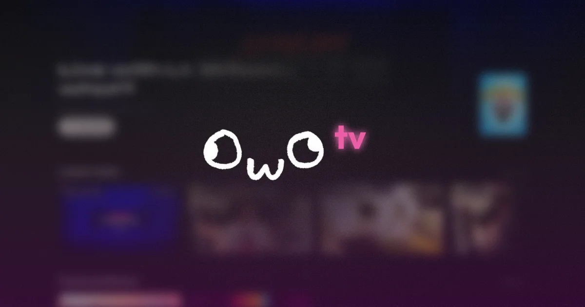

<div align="center">


# owoTV
A project to archive past VODs from Twitch.

</div>

## About this repo.
This is a project that uses [Baserow](https://baserow.io) to maintain a fully functional VOD archive for Twitch streams, or even videos from other platforms. Complete with chat replay, sorting by date or game, and keyword searching.

And of course, this project is open source and fully available under the [MIT License](LICENSE) - modify to your hearts content.

## How does it work?
Originally derived from my own [website](https://github.com/rcwowo/website), which was in itself derived from the [astro-erudite](https://github.com/jktrn/astro-erudite) template, this project removed a lot of the unnecessary junk that was scattered around the website and made VOD archival it's own separate thing.

This project uses a combination of:

- A [Baserow](https://baserow.io) instance, which handles the database and webhook automations to deploy the site.
- A public S3 bucket that stores the chatlogs.
- The [Chatlogs CLI](https://github.com/rcwowo/chatlogs), which does the heavy lifting of adding database entries, downloading and uploading chatlogs, and hitting those webhooks.

This allows the site to remain static so it can be super fast and responsive to use, still be easily updated and maintained, and most importantly, be *technically* completely free to host!

## How do I modify this?
Until I make a full guide on how to create the entire system for yourself, you'll have to figure it out and make your own solution if you intend to fork this project. If you find a bug, please report it to me either here on GitHub, or on Discord.

That being said, if you still want to develop this for yourself, it's easy:

```sh
# Clone the repo
git clone https://github.com/rcwowo/owotv

# Install dependencies
cd owotv && bun install

# Setup the .env file (you'll have to provide your own keys and such)
cp .env.example .env

# Run the test server
bun dev
```