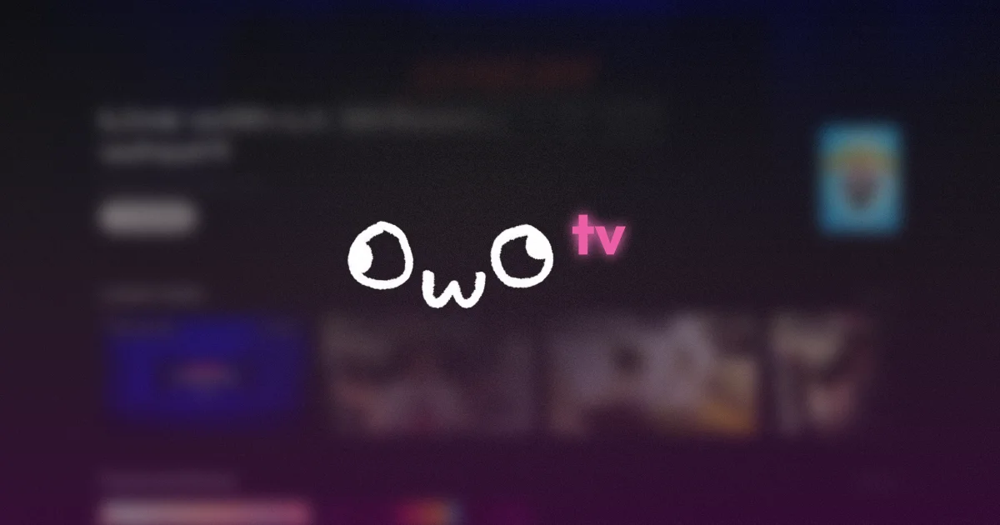

<div align="center">


# owoTV
A project to archive past VODs from Twitch.

</div>

## About this repo.
Originally starting as a static Astro site, this project has become a fully self-contained VOD archive for Twitch streams, or even videos from other platforms. Complete with chat replay, sorting by date, game, or searching by keyword.

And of course, this project is open source and fully available under the [MIT License](LICENSE) - modify to your hearts content.

## How does it work?
Originally derived from my own [website](https://github.com/rcwowo/website), this project removed a lot of the unnecessary junk that was scattered around the website and made VOD archival it's own separate thing. It also used to rely heavily on automations, however, the project is now a self-contained dynamic site instead of being purely static.

The project heavily relies on Cloudflare's stack:

- A [Cloudflare Worker](https://developers.cloudflare.com/workers/) renders the site on request via [Astro](https://astro.build) SSR.
- A [Cloudflare D1](https://developers.cloudflare.com/d1/) database stores all the applicable data.
- A [Cloudflare R2](https://developers.cloudflare.com/r2/) bucket stores the chatlogs for the chat replay feature.

## How do I modify this?
Until I make a full guide on how to create the entire system for yourself, you'll have to figure it out and make your own solution if you intend to fork this project. If you find a bug, please report it to me either here on GitHub, or on Discord.

That being said, if you still want to develop this for yourself, it's easy:

```sh
# Clone the repo
git clone https://github.com/rcwowo/owotv

# Install dependencies
cd owotv && bun install

# Create the databases
bun run db:create
bun run db:schema

# Run the test server
bun dev
```
